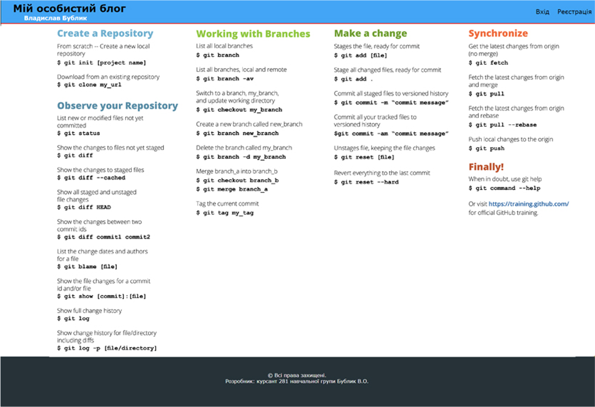

# Завдання на практичне заняття 1.6

## _Практика роботи з системою контроля версій Git._

---

## **Завдання 1**

### 1. Зареєструватись на GitHub-і.

### 2. Перейти за посиланням на [практичне завдання](https://github.com/oleksvlas/practicalTasks), зробити fork проекту до своїх репозиторіїв. Новостворений репозиторій потрібно перейменувати (в налаштуваннях репозиторію `Setting > Options > Repository name`), замість _"Tasks"_ додати власне прізвище латиськими літерами.

> Наприклад назва повина бути: "practicalVlasenko"

### 3. Додати в колоборати викладачів:

- oleksvlas [посилання](https://github.com/oleksvlas)
- yuriy-zdorenko [посилання](https://github.com/yuriy-zdorenko)

### 4. Зробти клон ностовореного репозиторію в робочий каталог файлової системи. Приклад команди:

```
git clone https://github.com/oleksvlas/practicalVlasenko
```

### 5. Для кожного практичного завдання портібно створювати окрему гілку (в гілці master розробку не виконувати!) Приклад команд:

```
git branch pz_1.6
git checkout pz_1.6
```

- Практичне завдання 1.6 - pz_1.6;
- Практичне завдання 1.9 - pz_1.9;
- Практичне завдання 1.11 - pz_1.11;
- Практичне завдання 1.13 - pz_1.13;
- тощо.

### 6. Виконати вимоги завдання 2.

### 7. Зробити push до глобального репозиторії і надати завдання на перевірку через pull request.

---

## **Завдання 2**

### 1. Створити каталог з назвою практичного завдання(pz_1.6), якщо такого не існує, та створити в ньому файл register.html, який буде містити форму регістрації курсантів навчальних груп.

_Шаблон:_


### 2. Виконати розмітку зи відповідно вказаних на зображены стилістичних та структурних вимог.

### 3. Після завершення обов'язково зробити комміт.

### 4. В католозі поточного практичного заняття, створити файл git_commands.html і записати команди Git наведені на наступному зображенні.

_Шаблон:_



### 5. Після розробки дизайну і наповнення кожної категорії робтити комміт:

- Create a Repository;
- Observe your Repository;
- Working with Branches;
- тощо.

### 6. Після виконання завдання відправити напрацювання на глобальний репозиторій (_push_) і надати на перевірку (_pull request_).
